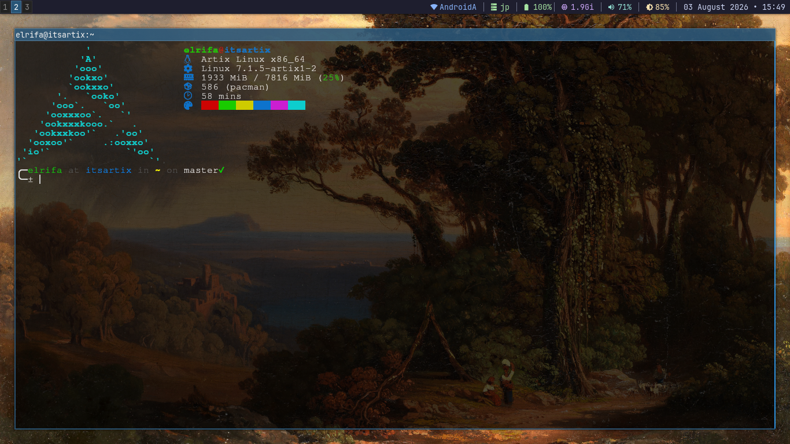

# dotfiles

My personal dotfiles for i3.



## Setup

- **WM**: i3
- **Bar**: i3blocks
- **Terminal**: Kitty
- **Launcher**: dmenu
- **Wallpaper**: feh
- **Font**: JetBrainsMono Nerd Font

## Features

- Clean i3 config with gaps and borders
- i3blocks bar with wifi, battery, memory, volume, brightness, and clock
- Nerd font icons with color coded modules
- Screenshot with maim (PrtSc to copy area to clipboard)
- Alt+Tab to cycle workspaces
- Super+Space to open dmenu

## Install

Clone into your home directory:

```
git clone https://github.com/alfahrel/dotfiles ~
```

Then reload i3 with **Mod4 + Shift + C**.
